# AWS EC2 instance

### SSH key storage

1. Move the appropriate file, in this case tech230.pem, containing your private SSH key provided to you by your organisation to your '.ssh' folder, located at 'C:/User/Username/.ssh'.

### Login to AWS

Your Login details must be kept confidential!
1. Use the provided details to login to AWS at [AWS DevOps login page](https://sparta-devops.signin.aws.amazon.com/console).
2. Ensure your region is the correct one. At Sparta we use 'Europe (Ireland) eu-west-1'.

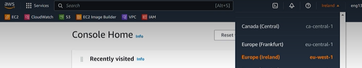

### Create EC2 instance

EC2 (Elastic Cloud 2) instance is essentially a Virtual Machine.

1. Search for EC2 in the search bar and select EC2.

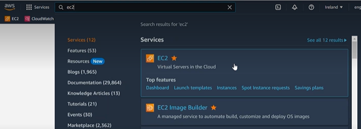

2. Scroll down and click on the orange 'Launch instance' and select 'Launch instance' from the drop down.

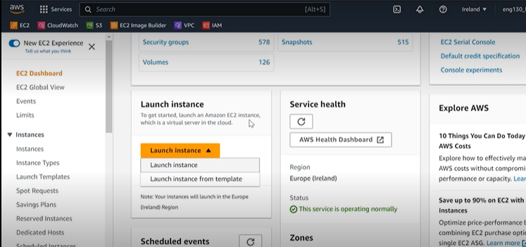

3. Name the instance according to good practice naming conventions for your organisation. Sparta follows this format: group, name, type of instance/resource (eg. tech230_esther_first_ec2)

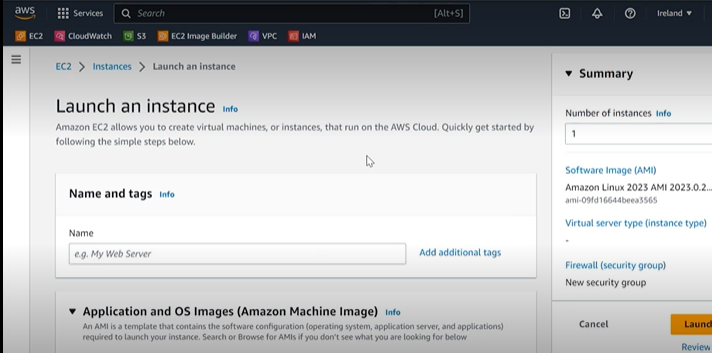

4. Scroll down and select the 'Quick Start' menu and select the OS you want and configure it with the settings you select. In this case: Ubuntu Server 22.04 etc. as shown in the image below.

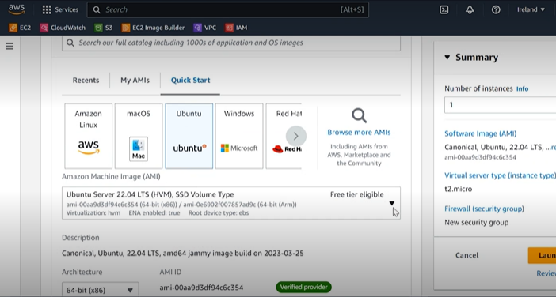

5. Scroll further and select the 'Instance type' shown below.  This, essentially, tells us how much hardware we need. (Note: We use t2.micro for all instances unless specifically told otherwise.)


6. Scroll down to 'Key pair (login)' and select the appropriate one, in this case 'tech230'.

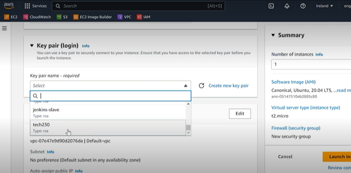

7. Scroll down to 'Network Settings' and click 'edit'. Then add a name, in this case 'tech230_esther_first_sg', and a description, in this case 'my first security group'.

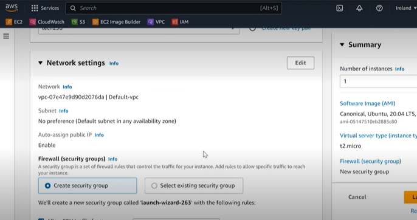

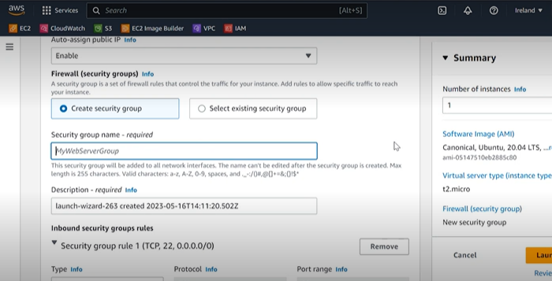

8. Scroll down to the 'Security Group' section - this is where you customise who can access your EC2 instance.


9. Scroll down to 'Configure storage', where you can add more or less storage to your instance.

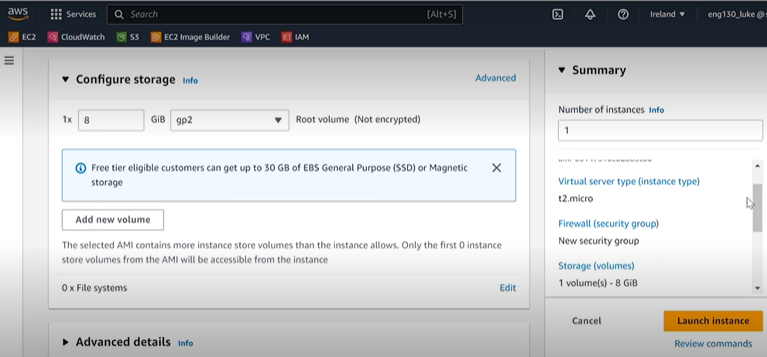

### Launch EC2 instance

10. On the side you can see the 'Summary' block where you can see all the configurations you have made. If you are happy with all of them then click the orange 'Launch instance' button at the bottom of the 'Summary' block.

### Exploring the information

If you go to 'Instances' page and it will show all the instances available. You can filter them to show the runnning instances or search for the name of your instance or your instance ID. You can see important information relating to the EC2 from here and the status check should say '2/2 checks passed' or 'initializing' if it has not yet done so. Once it says '2/2 checks passed' then you should be able to login to the EC2 instance. The public IPv4 is the address people will use to access the content the EC2 instance is sharing based on the settings specified. The Private IP is used to get into the EC2 instance itself.

### Connecting to the EC2 instance

11. Find your instance on the 'Instances' page and click on the blue 'Instance ID'.

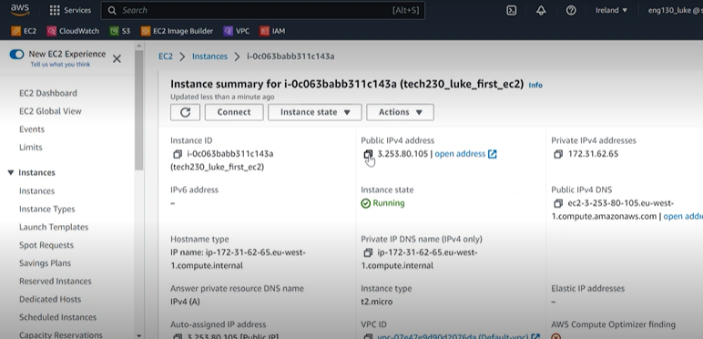

12. Click on the 'Connect' button on that page.

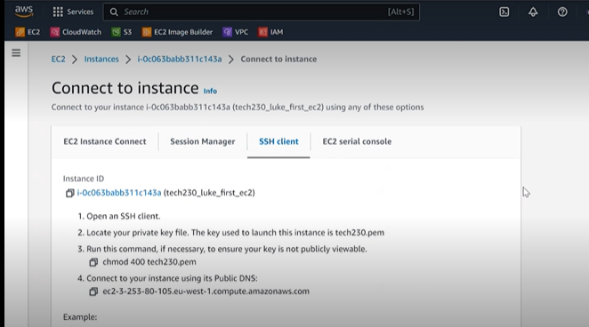

13. Ensure you select the 'SSH client'. It gives you instructions to connect, which I will outline in the next steps.
14. Open your terminal and cd into your '.ssh' directory, then enter `chmod 400 tech230.pem`, which allows reading privileges for all. It should not return anything. (Note: to see the permissions type `ls -l`)
15. Copy the generated code under 'Example' and paste it into your terminal and enter. (Breakdown command: `ssh i-` uses ssh protocol, i=identity; `"tech230.pem"` which is how we are gaining ssh access; `ubuntu` is the username that it should provide, if not change it before entering; `@ec2` followed by the relevant IP address; then followed by the data center)

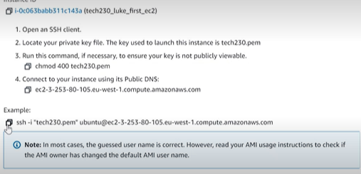

Your terminal should return if it is the first time you log in to your EC2 instance:

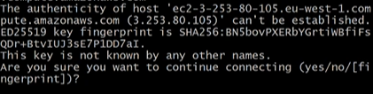

Which you should then type `yes` and enter to authenticate your connection. This should return that it has permanently added the host and log you in to the EC2 instance in the cloud.

### Setting up Nginx on EC2 instance

1. While logged in to EC2 instance run `sudo apt get update -y` and then `sudo apt get upgrade` (later versions of Linux do not need `get`).

(Note: If you get a pink screen about kernel upgrade 

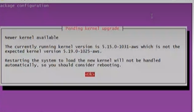

press 'Enter', then 'Esc' on the next screen

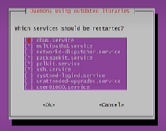.)

2. Run `sudo apt install nginx -y` to install Nginx. (If you had the error run `sudo apt get update -y` and then `sudo apt get upgrade` again at this point.)
3. Run `sudo systemctl start nginx` and then `sudo systemctl enable nginx` to start and enable Nginx. (Note: To check the status of Nginx use `sudo systemctl status nginx` which should show that it is active and running and hit 'q' to exit back to where you can type.)
4. Navigate back to your 'Instance summary' page on your web browser and scroll down and select the 'Security' tab.

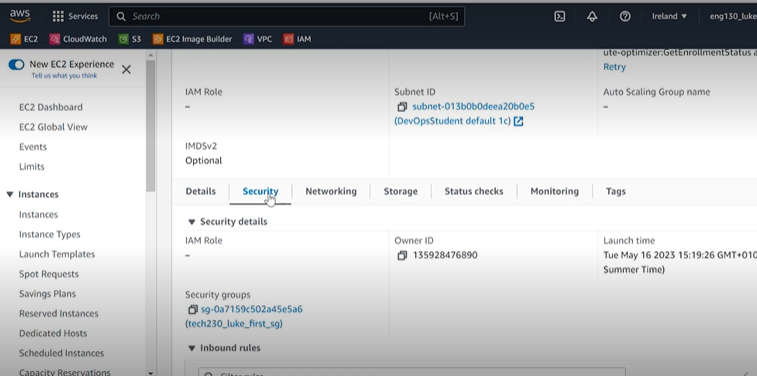

5. Click on the blue link under 'Security groups' above the 'Inbound rules' section.
6. Scroll down and click 'Edit inbound rules'.
7. Click 'Add rule' and configure it to be 'Type' 'HTTP' with a '0.0.0.0/0' 'Source' so everyone can access it.

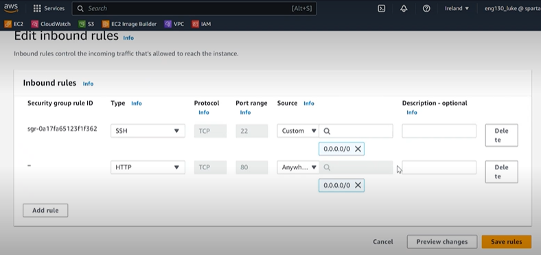

8. You should be able to access your Nginx webserver at the 'Public IPv4' found under 'Instance summary' on your web browser. Anyone who has the IP address and enters it into their web browser should be able to see the page, provided they have internet connection.

### Provisioning with User Data

When setting up your EC2 instance got to 'Advanced settings' and scroll down to the bottom and add the following code into the 'User data' block:
```
#!/bin/bash
sudo apt update -y
sudo apt upgrade -y
sudo apt install nginx -y
sudo systemctl start nginx
sudo systemctl enable nginx
```

### AMI - Amazon Machine Images

AMI is a template for an EC2 instance that is the same as a host system (EC2 instance) state - all files and installations and settings. It enables us to create multiple identical instances.

### Create AMI template

To create an AMI the EC2 must be up and running.

1. Select the check box of the instance you would like the AMI to be based on, the click the 'Actions' drop down, then the 'Images and templates' and click on 'Create template from instance'.

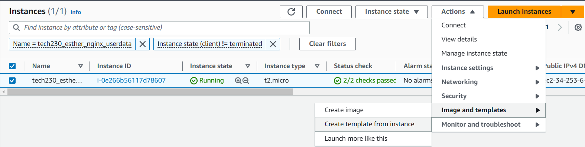

2. You will be taken to the 'Create launch template' screen where you will have to name your template, in this case 'tech230_esther_nginx_ami' and you can give it a description.

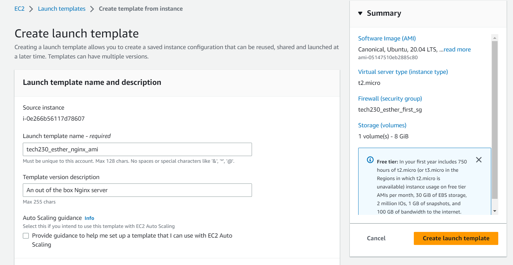

3. Check the settings and if you are happy with them, click 'Create launch template' in the 'Summary' box.
4. At this point you can terminate your base EC2 instance.
5. You can then select the orange 'Launch instance' drop down and select the 'Launch instance from template' option.
6. It will take you to a page where you can select your ami instance by its name and check the settings, which if you are happy with you can then click the orange 'Launch instance' button in the 'Summary' box.
7. You can then go to the 'Instances' page and search for your instance. Once the 'Status check' has '2/2 checks passed' you should be able to go to the Public IP address in your terminal and it should show the nginx server page.

### Add the 'app' directory to the EC2 instance

1. While logged into your EC2 instance: `scp /Documents/tech_230_sparta/tech230_virtualisation/tech230_app_deployment/app ubuntu@<EC2_Instance_IP>:/home/ubuntu` OR `sudo apt install rsync` then `rsync -avz -e "ssh -i /.ssh/tech230.pem" /Documents/tech_230_sparta/tech230_virtualisation/tech230_app_deployment/app ubuntu@<EC2_Instance_IP>:/home/ubuntu`


### Stop or Terminate your EC2 instance

1. Navigate back to your 'Instance summary' page and click on 'Instance state' drop down located next to 'Connect'.

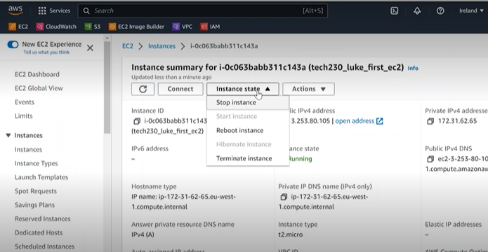

2. Select 'Stop instance' to stop the instance so it can be resumed at a later stage or 'Terminate instance' to remove the instance entirely (in this case 'Terminate instance').
